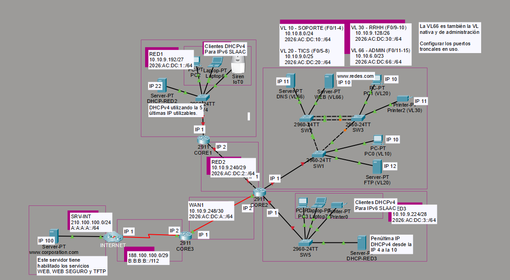

# Sin título


#### INFORME TÉCNICO: Optimización, seguridad, dual-Stack y convergencia de la infraestructura de red.

---

**Sección: 001D**

**Integrantes del Equipo de Trabajo:**

- Javier Ignacio Rojas Valenzuela
- Sebastian Maximiliano Zambrano Prieto

**Fecha de Entrega:** 23/06

---

## **ÍNDICE**

### **1. Introducción**

### **2. Desarrollo**

- 2.1 Direccionamiento IP
- 2.2 Situación inicial de la infraestructura
- 2.3 Identificación de problemas
- 2.4 Configuraciones de las direcciones IP
- 2.5 Defensa de servicios e Integridad (DHCP Snooping y AAA)
- 2.6 Diagnóstico de Seguridad Perimetral (ZBF)

### **3. Conclusiones**

### **4. Bibliografía**

## 1. Introducción

El presente informe tiene como objetivo evidenciar el estado actual de la infraestructura de red de la empresa “REDES.COM”. Desde la situación actual se ha demostrado que la empresa mencionada en este informe ha presentado diferentes problemas técnicos en su infraestructura, estos problemas son:

- Mala implementación de switches.
- Problemas de rendimiento.
- Convergencia lenta de enlaces.
- Falta de administración en los dispositivos de red.
- Vulnerabilidades de seguridad en equipos de capa 2 y capa 3.

Durante este informe se detallaran, explicarán y justificarán las diversas tecnologías implementadas en la infraestructura para mitigar los problemas detallados anteriormente. Asimismo, se adjuntará el respaldo de las configuraciones aplicadas junto con la tabla de direccionamiento IP correspondiente.

---

## 2. Desarrollo

A continuación se adjunta una imagen que representa la topología lógica de la red para poder tener claridad y puntos de referencia visuales para poder explicar conceptos a lo largo del desarrollo del documento.



### 2.1 Direccionamiento IP

A continuación se detalla el direccionamiento IP de la topología con sus rangos y mascaras de subred.

- Tabla IPv4 e IPv6
    
    
    | **SUBRED** | **NOMBRE** | **Dirección de red/máscara IPv4** | **Dirección de red/máscara IPv6** |
    | --- | --- | --- | --- |
    | VLAN 10 | SOPORTE | 10.10.8.0/24 | 2026:AC:DC:10::/64 |
    | VLAN 20 | TICS | 10.10.9.0/25 | 2026:AC:DC:20::/64 |
    | VLAN 30 | RRHH | 10.10.9.128/26 | 2026:AC:DC:30::/64 |
    | VLAN 66 | ADMIN | 10.10.6.0/23 | 2026:AC:DC:66::/64 |
    | WAN1 | WAN1 | 10.10.9.248/30 | 2026:AC:DC:A::/64 |
    | RED1 | RED1 | 10.10.9.192/27 | 2026:AC:DC:1::/64 |
    | RED2 | RED2 | 10.10.9.240/29 | 2026:AC:DC:2::/64 |
    | RED3 | RED3 | 10.10.9.224/28 | 2026:AC:DC:3::/64 |
    | INT | INT | 188.100.100.0/29 | B:B:B:B::/112 |
    | SRV-INT | SRV-INT | 210.100.100.0/24 | A:A:A:A::/64 |
    
    <aside>
    
    **NOTA:** Se especifican las mascaras en formato abreviado
    
    </aside>
    

### 2.2 Situación inicial de la infraestructura

Con el fin de mantener claridad y evidenciar el estado inicial de la infraestructura, se adjuntan en la tabla los dispositivos que mantiene la empresa, su función principal y aspectos mas relevantes de su configuración. 

| **Dispositivo / Segmento** | **Cantidad** | Nombre en topología  | **Función Principal**
 |
| --- | --- | --- | --- |
| Router de borde | 1 | CORE3 | Conexión con el ISP, enrutamiento externo, seguridad (firewall) y NAT. |
| Routers Core | 2 | CORE1 y CORE2 | Conexión y enrutamiento entre distintas redes, aplicar listas de acceso y segmentación.  |
| Switches SW1,SW2 y SW3 | 3 | SW1,SW2 y SW3 | Entorno VLAN, seguridad de capa 2 y redundancia de enlaces. |
| Switches locales | 2 | SW4 y SW5 | Acceso a la red e implementación de protocolos de seguridad (DHCP Snooping) |
| Servidores Locales | 5 | DHCP-RED2, DHCP-RED3, DNS,WEB y FTP. | Servidores multiroles, proveen DHCP a sus redes conectadas y servicios de autenticación para dispositivos de red. |

#### Configuraciones de dispositivos.

A continuación, se exponen las memorias de configuración de los dispositivos más críticos de la topología. Para optimizar la lectura, se detallarán únicamente los parámetros y comandos más relevantes de cada equipo.

- Router de borde (CORE3)
    
    ```jsx
    Router#show ip interface brief 
    Interface              IP-Address      OK? Method Status                Protocol 
    GigabitEthernet0/0     unassigned      YES unset  administratively down down 
    GigabitEthernet0/1     unassigned      YES unset  administratively down down 
    GigabitEthernet0/2     unassigned      YES unset  administratively down down 
    Serial0/2/0            10.10.9.250     YES manual up                    up 
    Serial0/2/1            unassigned      YES unset  up                    up 
    Vlan1                  unassigned      YES unset  administratively down down
    
    Router#show running-config | section route
    ip route 0.0.0.0 0.0.0.0 172.16.9.249 
    ipv6 route ::/0 2026:AB:CD:A000::249
    ```
    
- Router core (CORE2)
    
    ```jsx
    Router#show ip interface brief 
    Interface              IP-Address      OK? Method Status                Protocol 
    GigabitEthernet0/0     unassigned      YES NVRAM  administratively down down 
    GigabitEthernet0/1     unassigned      YES NVRAM  administratively down down 
    GigabitEthernet0/2     10.10.8.1       YES NVRAM  administratively down down 
    Serial0/3/0            100.10.9.250    YES manual up                    up 
    Serial0/3/1            unassigned      YES unset  down                  down 
    Vlan1                  unassigned      YES unset  administratively down down
    ```
    
- Router core (CORE1)
    
    ```jsx
    Router#show ip interface brief 
    Interface              IP-Address      OK? Method Status                Protocol 
    GigabitEthernet0/0     unassigned      YES NVRAM  administratively down down 
    GigabitEthernet0/1     unassigned      YES NVRAM  administratively down down 
    GigabitEthernet0/2     10.10.10.1      YES manual administratively down down 
    Serial0/3/0            unassigned      YES NVRAM  down                  down 
    Serial0/3/1            unassigned      YES manual administratively down down 
    Vlan1                  unassigned      YES unset  administratively down down
    
    Router#show ip protocols 
    
    Routing Protocol is "ospf 2020"
      Outgoing update filter list for all interfaces is not set 
      Incoming update filter list for all interfaces is not set 
      Router ID 0.0.0.0
      Number of areas in this router is 0. 0 normal 0 stub 0 nssa
      Maximum path: 4
      Routing for Networks:
      Passive Interface(s): 
        GigabitEthernet0/2
      Routing Information Sources:  
        Gateway         Distance      Last Update 
      Distance: (default is 110)
    ```
    
- SW1
    
    ```jsx
    Switch#show running-config 
    Building configuration...
    
    Current configuration : 1080 bytes
    
    version 15.0
    no service timestamps log datetime msec
    no service timestamps debug datetime msec
    no service password-encryption
    
    hostname Switch
    ```
    
- SW2
    
    ```jsx
    Switch#show running-config 
    Building configuration...
    
    Current configuration : 1080 bytes
    
    version 15.0
    no service timestamps log datetime msec
    no service timestamps debug datetime msec
    no service password-encryption
    
    hostname Switch
    ```
    
- SW3
    
    ```jsx
    Switch#show running-config 
    Building configuration...
    
    Current configuration : 1080 bytes
    
    version 15.0
    no service timestamps log datetime msec
    no service timestamps debug datetime msec
    no service password-encryption
    
    hostname Switch
    ```
    
- SW4
    
    ```jsx
    Switch#show running-config 
    Building configuration...
    
    Current configuration : 1192 bytes
    
    version 15.0
    no service timestamps log datetime msec
    no service timestamps debug datetime msec
    no service password-encryption
    
    hostname Switch
    
    spanning-tree mode pvst
    spanning-tree extend system-id
    
    interface FastEthernet0/1
    
    interface FastEthernet0/2
    
    interface FastEthernet0/3
    
    interface FastEthernet0/4
     switchport access vlan 100
     switchport mode access
     
    interface FastEthernet0/24
     switchport trunk allowed vlan 15-16
     switchport mode trunk
    
    ```
    
- SW5
    
    ```jsx
    Switch#show running-config 
    Building configuration...
    
    Current configuration : 1080 bytes
    
    version 15.0
    no service timestamps log datetime msec
    no service timestamps debug datetime msec
    no service password-encryption
    
    hostname Switch
    ```
    

## 2.3 Identificación de problemas

A continuación se detallan los problemas encontrados en los dispositivos. También se detallan las soluciones para cumplir los requerimientos.

- Router borde (CORE3)
    1. No tener protocolos de enrutamiento habilitado (OSPF).
    2. No tener el direccionamiento IP correctamente asignado.
    3. No tener habilitado NAT con sus ACLs ni comandos. 
    4. No tener habilitado el modulo de firewall ni marco AAA.
- Router CORE2
    1. No tener protocolos de enrutamiento habilitado (OSPF).
    2. No tener el direccionamiento IP correctamente asignado.
    3. No contar con marco AAA.
    4. No tener creadas las subinterfaces para las VLANs
- Router CORE1
    1. No tener protocolos de enrutamiento habilitado (OSPF).
    2. No tener el direccionamiento IP correctamente asignado.
    3. No tener habilitado el modulo de firewall ni marco AAA.
- SW1,SW2 y SW3
    1. Los switches no poseen ninguna configuración básica de los protocolos requerida para la topología. (STP, Port-security y VLANs)
- SW4
    1. El switch presenta inconsistencias en la asignación de VLANs a puertos físicos. (VLAN100 no requerida)
    2. El switch presenta inconsistencia en la asignación de un puerto troncal hacia el router (VLAN15-16 no requeridas y no se requiere RoaS)
- SW5
    1. El switch no presenta las configuraciones requeridas (DHCP Snooping) 

<aside>

**NOTA:** Los dispositivos finales no cumplían con la correcta asignación de IP, Mascara ni Gateway. Eso genera conflictos de IP, problemas para la comunicación y correcto funcionamiento de los servicios.

</aside>

Para darle solución a estos problemas y cumplimiento de los requerimientos se proponen las siguientes soluciones. 

#### Dispositivos de capa 3

- Para garantizar el correcto enrutamiento se habilitara el protocolo OSPFv2 y v3 en todos los routers.
- Habilitar direccionamiento IPv6 para convertir la infraestructura en Dual-Stack y así asegurar un correcto funcionamiento.
- Asignar correctamente el direccionamiento IP correcto en todas las interfaces y subinterfaces de los routers.

#### Dispositivos de capa 2

- Crear todas las VLANs requeridas en todos los switches para no tener problemas en las bases de datos.
- Asignar puertos troncales y vlan nativa a cada switch.
- Asignar las vlans a las interfaces solicitadas en los switches.
- Implementar STP en switches con valores alternos de prioridad según vlan para asegurar convergencia completa.
- Implementar Port-security en puertos conectados a dispositivos críticos.

## 2.4 Configuraciones de las direcciones IP

| DISPOSITIVO | INTERFAZ | IPV4 | IPV6 |
| --- | --- | --- | --- |
| CORE1 | G0/1 | 10.10.9.193/27 | 2026:AC:DC:1::1/64 |
| CORE1 | G0/0 | 10.10.9.242/29 | 2026:AC:DC:2::2/64 |
| CORE2 | G0/0 | 10.10.9.241/29 | 2026:AC:DC:2::1/64 |
| CORE2 | G0/1 | 10.10.9.225/28 | 2026:AC:DC:3::1/64 |
| CORE2 | G0/2 | 10.10.8.1/24 | 2026:AC:DC:10::1/64 |
| CORE2 | S0/3/0 | 10.10.9.250/30 | 2026:AC:DC:A::2/64 |
| CORE3 | S0/2/0 | 10.10.9.249/30 | 2026:AC:DC:A::1/64 |
| CORE3 | S0/2/1 | 188.100.100.2/29 | B:B:B:B::2/112 |

### Tabla direccionamiento de puentes

| VLAN | ROOT PRINCIPAL | ROOT RESPALDO |
| --- | --- | --- |
| VLAN 10 SOPORTE | SW1 | SW2 |
| VLAN 20 TICS | SW2 | SW1 |
| VLAN 30 RRHH | SW3 | SW1 |
| VLAN 66 ADMIN | SW3 | SW2 |

### **Tabla de direccionamiento de dispositivos finales**

| Dispositivo | Red/VLAN | IPv4 | IPv6 |
| --- | --- | --- | --- |
| WEB | VLAN 66 | 10.10.6.10 | 2026:AC:DC:66::10 |
| DNS | VLAN 66 | 10.10.6.11 | 2026:AC:DC:66::11 |
| PC0 | VLAN 10 | 10.10.8.10 | 2026:AC:DC:10::10 |
| PC1 | VLAN 20 | 10.10.9.10 | 2026:AC:DC:20::10 |
| FTP | VLAN 20 | 10.10.9.12 | 2026:AC:DC:20::12 |
| PRINTER2 | VLAN 30 | 10.10.9.139 | 2026:AC:DC:30::11 |
| DHCP-RED1 | RED1 | 10.10.9.222 | 2026:AC:DC:1::22 |
| PC2 | RED1 | DHCP (10.10.9.218-221) | SLAAC |
| LAPTOP6 | RED1 | DHCP (10.10.9.218-221) | SLAAC |
| SIRENA IOT | RED1 | DHCP (10.10.9.218-221) | SLAAC |
| DHCP-RED3 | RED3 | 10.10.9.237 | 2026:AC:DC:3::13 |
| PC3 | RED3 | DHCP (10.10.9.228-234) | SLAAC |
| LAPTOP7 | RED3 | DHCP (10.10.9.228-234) | SLAAC |
| PRINTER0 | RED3 | DHCP (10.10.9.228-234) | SLAAC |
| Servidor-EXT | SRV-INT | 210.100.100.100 | A:A:A:A::64 |

## 2.5 Defensa de servicios e Integridad (DHCP Snooping y AAA)

Como se menciono anteriormente la infraestructura de red presenta vulnerabilidades, por lo que a continuación se detallan las soluciones, protocolos y justificación técnica. 

#### Implementación de marco AAA con servidor TACACS+ en CORE2

Debido a que el Router Core 2 es un nodo crítico para la infraestructura de red, es fundamental garantizar su protección. Para ello, se implementó el servicio **TACACS+**, el cual proporciona un mecanismo de autenticación centralizado. Esto permite que los ingenieros validen sus credenciales directamente contra un servidor dedicado en lugar de gestionarlas de forma local en el router. Asimismo, el servidor administra una base de datos de usuarios que facilita la asignación detallada de niveles de privilegios según el perfil del operador.

- Configuración
    
    ```jsx
    username admin secret admin123
    
    aaa new-model 
    tacacs-server host 172.16.9.222 key network
    aaa authentication login default group tacacs+ local
    line vty 0
    login authentication default 
    ```
    
- Tabla de usuarios
    
    
    | **Nombre cliente** | **IP cliente** | **Key** | **Usuario** | **Contraseña** |
    | --- | --- | --- | --- | --- |
    | CORE2 | 10.10.9.225 | network | adm1 | pruebas |
    |  |  |  | adm2 | pruebas |

#### Implementación de marco AAA con servidor Radius en CORE1

Al ser el Router Core 1 un nodo crítico de la infraestructura, su seguridad es prioritaria. Para este equipo se implementó el protocolo RADIUS, seleccionándolo por encima de TACACS+ debido a su eficiencia en la autenticación y autorización integradas en un solo paso, lo que optimiza los tiempos de respuesta del sistema. RADIUS permite centralizar la validación de credenciales de los ingenieros contra una base de datos externa en lugar de gestionarlas de forma local, facilitando además la integración estándar con políticas de control de acceso a la red y asignación de perfiles de usuario.

- Configuración
    
    ```jsx
    username admin secret admin123
    
    radius server SERVIDOR_RADIUS
    address ipv4 172.16.9.140
    key redes
    
    aaa new-model 
    aaa authentication login ACCESO-RADIUS group radius local
    
    line vty 0 1
    transport input telnet
    ```
    
- Tabla de usuarios
    
    
    | **Nombre cliente** | **IP cliente** | **Key** | **Usuario** | **Contraseña** |
    | --- | --- | --- | --- | --- |
    | CORE3 | 10.10.9.249 | redes | user1 | prueba |
    |  |  |  | User2 | prueba |

#### Implementación de marco AAA con Local en CORE3

El Router de Borde constituye el punto de entrada y salida de todo el tráfico de la organización, por lo que su disponibilidad y seguridad son críticas. Para este dispositivo se optó por una implementación de AAA Local en lugar de depender de servidores externos como RADIUS o TACACS+. Esta decisión se justifica como una medida de tolerancia a fallos y alta disponibilidad: en caso de una pérdida total de conectividad con la red interna o una caída de los servidores de autenticación centralizados, el personal mantendrá el acceso garantizado al equipo de borde a través de su base de datos local para realizar tareas de contingencia y resolución de problemas.

- Configuración
    
    ```jsx
    username admin secret admin123
    
    aaa new-model
    aaa authentication login default local 
    line vty 0 1 
    login authentication default 
    ```
    

Los usuarios se definen en el mismo router, además de designar un usuario de respaldo como se pudo apreciar en todos los routers. 

#### Implementación DHCP Snooping

Para implementar DHCP Snooping se basan en dos puntos principales, a continuación se detallan.

- **Mitigación de Servidores DHCP Maliciosos (*Rogue DHCP Servers*):** Si un usuario conecta por error o de forma maliciosa un router doméstico o un servidor DHCP no autorizado en un puerto de acceso de LAN2 o LAN3, este dispositivo comenzará a responder a las solicitudes de IP de otros usuarios. Esto genera asignaciones de direccionamiento erróneas, provocando caídas masivas del servicio por falta de conectividad o colisión de redes. Esto con el fin de proteger los dispositivos y usuarios de las redes LAN.

- **Prevención de Ataques de *Man-in-the-Middle* (MitM) mediante *DHCP Spoofing*:** Un atacante podría usar un servidor DHCP falso para alterar los parámetros de red que reciben las víctimas, configurando su propia dirección IP como la "Puerta de enlace predeterminada" (*Default Gateway*) o como el servidor DNS. Con esto, todo el tráfico de los usuarios de LAN2 y LAN3 pasaría primero por el atacante antes de salir a internet, permitiéndole interceptar y clonar información confidencial.

- **Justificación del Límite de Tasas (Rate Limit) en LAN2 y LAN3:**El límite de tasas (*rate limit*) se configura en los puertos no confiables de acceso para evitar ataques de agotamiento o denegación de servicio (DHCP Starvation). Al limitar la cantidad de paquetes DHCP que un puerto puede recibir por segundo, se impide que un atacante inunde el servidor legítimo con múltiples solicitudes falsas para agotar el pool de direcciones IP.

## 2.6 Diagnóstico de Seguridad Perimetral (ZBF)

La implementación de un Firewall Basado en Zonas (ZBF) en el router de borde se justifica como el pilar fundamental para el control de acceso y mitigación de amenazas perimetrales. 

- **Segmentación por Zonas de Seguridad Lógicas:** El diseño se estructura mediante la segregación del tráfico en dos zonas de seguridad bien definidas: **PRIVADA** (representando el entorno local, confiable y protegido de la empresa) y **PUBLICA** (representando la red de transporte del ISP e Internet, catalogada como un entorno totalmente inseguro y no confiable).

- **Seguridad Implícita (Premisa Denegar Todo / *Deny All*):** Por defecto, el ZBF bloquea de forma nativa todo el tráfico de datos inter-zona. La existencia de esta política implícita de denegación absoluta garantiza que ningún paquete externo pueda penetrar la infraestructura privada a menos que exista una regla explícitamente programada por la administración de TI.

- **Escalabilidad y Adaptabilidad Estructural:** A diferencia de las ACL que se atan rígidamente a interfaces físicas individuales, las políticas de ZBF se aplican a contenedores lógicos (zonas). Si la organización se expande en el futuro e incorpora nuevas interfaces físicas o subinterfaces VLAN en su red interna, basta con asociar dichos puertos a la zona **PRIVADA** para que hereden de forma inmediata y automática el mismo nivel de protección, simplificando drásticamente la gestión y auditoría.

#### Lógica del Parámetro de Coincidencia Múltiple (match-any) en el Mapa de Clase TRAFICO-ISP

Dentro del router de borde, el mapa de clase (class-map) cumple la función crítica de inspeccionar y categorizar los paquetes que viajan hacia el exterior. La selección del parámetro técnico match-any en la clase TRAFICO-ISP obedece a la siguiente lógica operativa:

- **Comportamiento Lógico OR:** Al declarar un mapa de clase del tipo inspect match-any, el motor de inspección del router aplica un operador lógico OR. Esto significa que un flujo de datos será clasificado positivamente dentro de la clase TRAFICO-ISP si cumple con **al menos uno** de los criterios o protocolos permitidos (por ejemplo: HTTP, HTTPS, DNS o ICMP).

#### Flujo de Inspección Estructurado de la Política REDPRIVADAREDPUBLICA

Para permitir que la zona PRIVADA consuma recursos en la zona PUBLICA manteniendo el perímetro cerrado a peticiones intrusivas del exterior, se define un Par de Zonas (*Zone-Pair*) que vincula el origen y destino, gobernado por el mapa de políticas (policy-map) denominado REDPRIVADAREDPUBLICA.

- **Origen del Flujo**: Un host ubicado en la subred interna genera una solicitud de conexión (por ejemplo, una sesión web hacia Internet). Los paquetes ingresan al router por un puerto asignado a la zona PRIVADA con destino a un puerto en la zona PUBLICA.

- **Match de la Política**: El router intercepta el tráfico, detecta que existe un par de zonas activo y contrasta el paquete contra el mapa de clase de la política. Al validar que el protocolo del paquete coincide bajo la lógica match-any, se activa la acción de inspección con estado (inspect).

A continuación se muestra la configuración de ZBF en la infraestructura.

```jsx
zone security PRIVADA
exit
zone security PUBLICA

class-map type inspect match-any TRAFICO-ISP
match protocol http
match protocol https
match protocol dns
match protocol ftp
exit

policy-map type inspect REDPRIVADA-REDPUBLICA
class type inspect TRAFICO-ISP
inspect 
exit
exit

zone-pair security NUEVA source PRIVADA destination PUBLICA
service-policy type inspect REDPRIVADA-REDPUBLICA
exit

interface Se 0/2/0
zone-member security PRIVADA
interface Se 0/2/1 
zone-member security PUBLICA
```

## 3. Conclusión

Tras el análisis y las mejoras realizadas en la infraestructura de REDES.COM, se identificó que la red presentaba varias debilidades importantes. Entre ellas destacaban la falta de una segmentación adecuada, la ausencia de mecanismos de seguridad en los puertos de acceso y la inexistencia de políticas sólidas de enrutamiento y protección perimetral.

Para abordar estas deficiencias, se implementó una arquitectura Dual-Stack que permite el funcionamiento simultáneo de IPv4 e IPv6, junto con el protocolo OSPF. Esta combinación mejoró significativamente la estabilidad de la red, reduciendo los tiempos de convergencia y optimizando el rendimiento general.

En cuanto a la gestión de accesos y la seguridad operativa, se optó por un esquema AAA distribuido mediante TACACS+, RADIUS y autenticación local. Esta estrategia permitió un control más preciso sobre el acceso a los dispositivos de red y proporcionó una alternativa de respaldo ante posibles fallos en el router de borde CORE3.

También se incorporó DHCP Snooping en la capa de acceso, una medida clave para prevenir ataques internos relacionados con servidores DHCP no autorizados y posibles intentos de intermediación de tráfico dentro de la red.

Como parte de la modernización de la seguridad perimetral, se implementó un Firewall Basado en Zonas (ZBF). Su enfoque basado en el principio de denegar por defecto y la separación del tráfico en zonas privadas y públicas facilita la administración de políticas de seguridad, permitiendo una mayor flexibilidad para futuras ampliaciones de la infraestructura sin depender de listas de control de acceso complejas en cada interfaz.

Finalmente, se recomienda mantener una supervisión continua de los registros generados tanto por el ZBF como por los servidores AAA. Esto permitirá detectar comportamientos inusuales de forma temprana y fortalecer la capacidad de respuesta frente a posibles incidentes de seguridad.

## 4. Bibliografía

**Cisco Systems. (2024).** *Comprender el diseño de firewall de políticas basado en zonas*. [https://www.cisco.com/c/es_mx/support/docs/security/ios-firewall/98628-zone-design-guide.html](https://www.cisco.com/c/es_mx/support/docs/security/ios-firewall/98628-zone-design-guide.html)

**Cisco Systems. (2014).** *Cliente DHCP o servidor con configuración de router ZBF*. [https://www.cisco.com/c/es_mx/support/docs/security/ios-firewall/116117-configure-dhcp-zbf-00.html](https://www.cisco.com/c/es_mx/support/docs/security/ios-firewall/116117-configure-dhcp-zbf-00.html)

**Cisco Systems. (2015).** *Configuring DHCP Snooping*. [https://www.cisco.com/c/en/us/td/docs/routers/7600/ios/15S/configuration/guide/7600_15_0s_book/snoodhcp.html](https://www.cisco.com/c/en/us/td/docs/routers/7600/ios/15S/configuration/guide/7600_15_0s_book/snoodhcp.html)

**Cisco Systems. (2006**). *Configuración de un router Cisco con autenticación TACACS+*. [https://www.cisco.com/c/es_mx/support/docs/security-vpn/terminal-access-controller-access-control-system-tacacs-/13865-tacplus.html](https://www.cisco.com/c/es_mx/support/docs/security-vpn/terminal-access-controller-access-control-system-tacacs-/13865-tacplus.html)

[https://app.notion.com](https://app.notion.com)